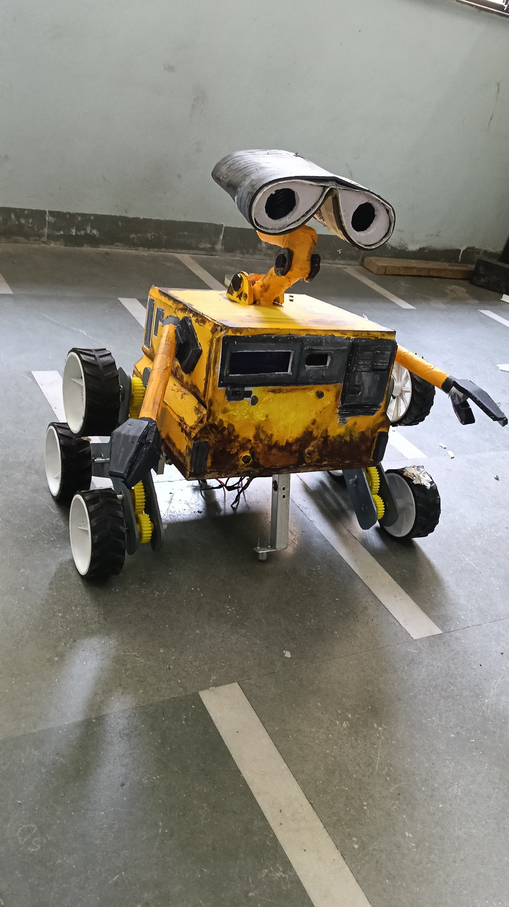
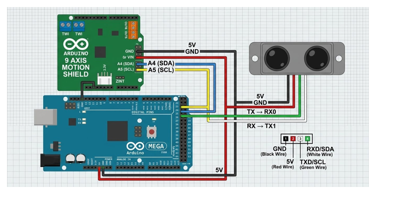
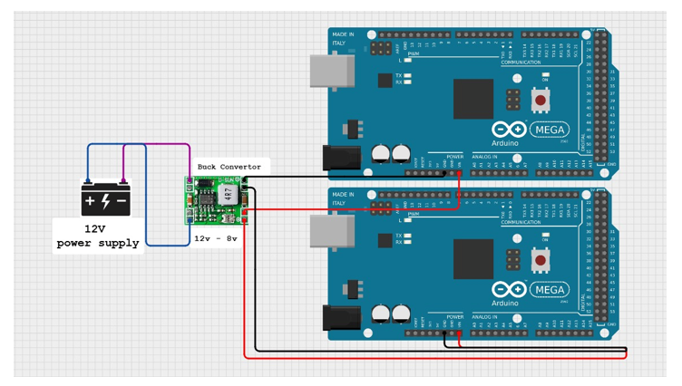
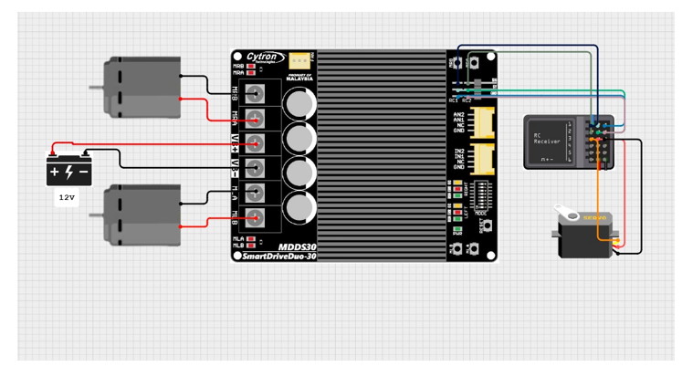
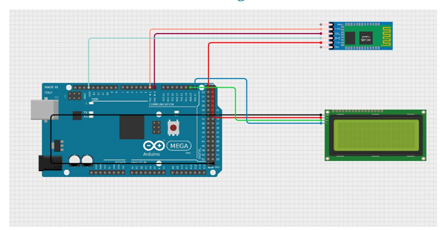

# WALL-E Replica Rover 🤖

A school project replicating **WALL-E** with a unique **three-wheel-per-side rocker design** that lets it climb hard terrain like stairs. The rover is dual-Arduino controlled, RC/Bluetooth operated, and features a moving head, obstacle sensing, and a live status display.

---

## ✨ Features

- **Stair/hard-terrain climbing** using a 3-wheel rocker-style suspension on each side
- **Dual-motor drivetrain** powered by 2x Johnson 300 RPM motors
- **RC control** via FlySky receiver + Cytron MDD S30 motor driver
- **Movable head** driven by a 60kg servo, controlled from a separate channel on the Bluetooth receiver
- **Obstacle detection** using a TF-Mini LiDAR (UART communication)
- **9-Axis Motion Sensing** via Bosch 9-Axis Motion Shield (accelerometer in X & Y, plus other onboard sensor features)
- **Live onboard display** — 12x2 I2C LCD showing data received wirelessly over HC-05 Bluetooth
- **Dual Arduino architecture** — a Master and a Slave Arduino dividing sensing/control and display duties

---

## 🧠 System Architecture

The brain of the rover is split across **two Arduino Mega boards**:

### Master Arduino
Handles all sensing and core control:
- **TF-Mini LiDAR** — connected via UART on **Pin 18 (TX1)** and **Pin 19 (RX1)** for distance/obstacle sensing
- **Bosch 9-Axis Motion Shield** — provides accelerometer data (X & Y axis) and other motion-sensing features, communicating over I2C (A4/SDA, A5/SCL)
- Drives the **Cytron MDD S30** motor driver based on FlySky RC receiver input
- Controls the **60kg head servo** via a separate RC channel

### Slave Arduino
Dedicated to output/display duties:
- Drives the **12x2 I2C LCD** display
- Receives data wirelessly through the **HC-05 Bluetooth module** and displays it in real time

---

## 🔌 Circuit Diagrams

### 1. TF-Mini LiDAR + 9-Axis Motion Shield Wiring
Master Arduino Mega connected to the 9-Axis Motion Shield (I2C on A4/A5) and TF-Mini LiDAR (UART on pins 18/19, TX→RX0, RX→TX1).

### 2. Power Supply — 12V Battery + Buck Converter
A 12V supply is stepped down through a buck converter (12V → 8V) to power both Arduino Mega boards.

### 3. Motor Driver, RC Receiver & Head Servo
Cytron SmartDriveDuo-30 (MDD S30) driving the two Johnson 300 RPM drive motors, powered by a 12V battery, and controlled by the FlySky RC receiver. The receiver also drives the 60kg head servo on a separate channel.

### 4. Bluetooth Module + LCD Display Wiring
Slave Arduino Mega connected to the HC-05 Bluetooth module and the 12x2 I2C LCD display for real-time status output.

---

## 🛠️ Components Used

| Component | Purpose |
|---|---|
| 2x Arduino Mega (Master + Slave) | Main controllers |
| 2x Johnson 300 RPM Motors | Drivetrain |
| Cytron MDD S30 (SmartDriveDuo-30) | Motor driver |
| FlySky RC Receiver | Drive & servo control |
| 60kg Servo Motor | Head movement |
| Bosch 9-Axis Motion Shield | Accelerometer / motion sensing |
| TF-Mini LiDAR | Obstacle/distance sensing (UART) |
| HC-05 Bluetooth Module | Wireless data link |
| 12x2 I2C LCD | Status display |
| 12V Battery + Buck Converter | Power supply |

---

## 📸 Final Build

---

## 📌 Notes

- Make sure to place all circuit diagram images inside an `images/` folder in the repository root (already set up here) so they render correctly on GitHub.
- Update wiring pin numbers in the code to match the diagrams above if you modify the hardware setup.

---

## 🚀 Future Improvements

- Autonomous obstacle avoidance using the TF-Mini LiDAR data
- Improved head/arm articulation
- Mobile app for Bluetooth control instead of raw HC-05 pairing

---

*Built as a school project — replicating WALL-E's design and personality while solving real terrain-climbing challenges with a 3-wheel mechanism.*
